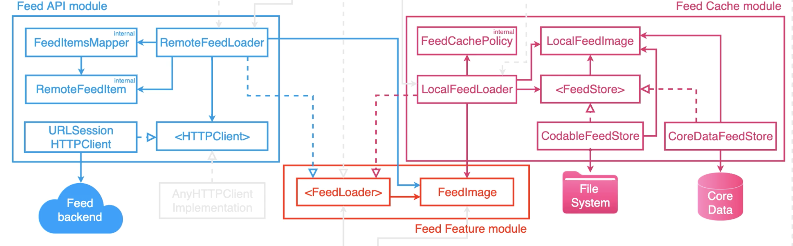

# iOS Feed Application - Feed Loading Framework

[](https://github.com/OmranK/iOSApp-Feed-FrontEnd/actions/workflows/CI.yml)

Framework for loading an Application's Feed built using TDD, CLEAN Architecture, Dependency Inversion and Continuous Integration.

---

## Introduction

In building a modular application, seperating components in order to achieve efficient development through fast unit testing is important. It's extremely useful to write UI independent code implementing logic driven behavior in a macOS framework, which runs the tests on the machine itself rather linking to a Simulator. This provides extremly fast testing - running a full suite of tests in a matter of seconds.


## Dependency Diagrams

By identifying the key behaviors needed by the core business logic and defining them in a protocol (interface) within the core module, we can then build out implementations (frameworks or modules that assist in achieving the required behavior) that are inversely dependent - they must fulfill the contract defined in the protocol. Thus we achieve modularity - decoupled components that can be swapped out at any point.

The best way to approach this type of design is to visualize the key components in a dependency diagram. Each component is responsible for defining or implementing certain behaviors. By creating logical separations we can then start to build out our system guided by a mental map that can be easily analyzed, changed, added to or removed from.

### Initial Dependency Graph


### Final Depenedency Graph


## Modules

This framework consists of logical modules that are bundled together for the sake of simplicity. While they are bundled together in a single framework, using dependency inversion and principles of CLEAN Architecture, they have been designed in a decoupled manner such that extracting them into separate frameworks is possible with a simple copy/paste and then import/linking.

### Feed Feature Module (Core)

The core business logic (model + a single base behavior requirement). 

- `FeedImage` - The data model for the object we will be working with.
- `<FeedLoader>` - The protocol that defines what behavior is needed to manipulate and work with the `FeedImage` model.

### Feed API Module (Networking)

Implementation of the behavior defined in the `<FeedLoader>` protocol achieved through networking with an API endpoint.

-  `RemoteFeedLoader` - Conforms to the `<FeedLoader>` and fulfills the defined contract.
-  `RemoteFeedItem` - Redefinition of the `FeedItem` model for the implementing module to define module-specific functionality within (without breaking the dependency inversion). Implementing this logic in the base `FeedItem` model would result in a (very hard to spot) implicit dependency where the core module would have added behavior for the sake of a collaborator. This model also allows components other than the `RemoteFeedLoader`in this module to be unaware of the base `FeedItem` model.
-  `FeedItemsMapper` - used by `RemoteFeedLoader` to map the JSON payload into `RemoteFeedItem`, since the backend's JSON data structure formatting does not match exactly with the `RemoteFeedItem` model. 
-  `<HTTPClient>` - The protocol that defines what behavior is needed by `RemoteFeedLoader` from an infrastructure collaborator it is interfacing with. (Networking)

- `URLSessionHTTPClient` - An implementation of `<HTTPClient>`. Handles networking and the various possible outcomes (error/success). Can be easily extracted into a separate module or replaced with any other implementation.
			
### Feed Cache Module (Local Cacheing)

Implementation of the behavior defined in the `<FeedLoader>` protocol achieved through cacheing locally onto the device.

-  `LocalFeedLoader` - Conforms to the `<FeedLoader>` and fulfills the defined contract.
-  `LocalFeedItem` - Abstraction similar to `RemoteFeedItem` in the previous section.
-  `<FeedStore>` - Protocol similar to `<HTTPClient>` in the previous section.
-  `FeedCachePolicy` - Set of rules defining the cache expiration and validation/invalidation behavior based on them.

Two different implementations of `<FeedStore>`. Each can easily be extracted into a separate module and swapped out for the other in production.

- `CodableFeedStore` - A cacheing store using a devices local file system.
- `CoreDataFeedStore` - A cacheing store using the CoreData framework.

## Testing

Each module has a comprehensive set of tests that ensure proper behavior is observed from interactions at every boundary. 

When writing the tests for the `CodableFeedStore` we ended up with a comprehensive testing suite for the behavior needed from a `<FeedStore>`. Using Xcode Assistant Editor's "Generated Interface" feature allowed the extraction of the tests into a set of reusable test specifications: `FeedStoreSpecs`. In addition, using protocol inheritance, protocol extension, protocol composition and conditional conformance, extraction of the test assertions was achieved.

This made the testing of `CoreDataFeedStore` implementation of `<FeedStore>` as easy as writing:

```
 func test_retrieve_deliversEmptyCacheOnEmptyCache() {
        let sut = makeSUT()
        assertThatRetrieveDeliversEmptyOnEmptyCache(on: sut)
    }
```  

The process can be analyzed further in the set of commits contained within this [merge](https://github.com/OmranK/iOSApp-Feed-FrontEnd/pull/10)


